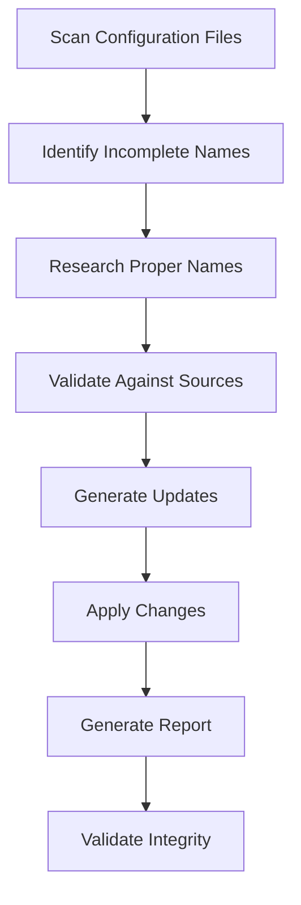

# Design Document: Language Name Normalization

## Overview

This feature will systematically identify and replace placeholder, abbreviated, or incomplete language names in the Language Mixer System with proper, full language names that accurately represent the languages they map to. The system will leverage authoritative linguistic sources, maintain existing base index mappings, and provide comprehensive reporting of all changes.

## Architecture

The language name normalization system will be implemented as a standalone Node.js tool that integrates with the existing language mixer maintenance workflow. It will follow the established patterns in the `tools/mixer-*` directory structure and work alongside existing tools like `fix-language-mixer-mappings.js` and the delta workflow system.

### High-Level Flow



## Components and Interfaces

### 1. Language Name Analyzer

**Purpose**: Identifies entries with incomplete, abbreviated, or placeholder names.

**Interface**:
```javascript
class LanguageNameAnalyzer {
  analyzeEntry(languageEntry) {
    // Returns analysis result with confidence score
  }
  
  identifyIncompleteNames(languageEntries) {
    // Returns array of entries needing normalization
  }
  
  prioritizeByUsage(incompleteEntries, usageStats) {
    // Returns prioritized list based on mixer usage
  }
}
```

**Detection Criteria**:
- Names shorter than 4 characters (excluding legitimate short names like "Ga")
- Names that are identical to ISO codes
- Names with generic patterns (e.g., "language", "dialect" suffixes without proper names)
- Names missing proper capitalization
- Names with inconsistent formatting within language families

### 2. Language Name Resolver

**Purpose**: Researches and determines proper language names from authoritative sources.

**Interface**:
```javascript
class LanguageNameResolver {
  resolveFromISO(isoCode) {
    // Returns proper name from ISO 639 standards
  }
  
  resolveFromWikipedia(wikipediaUrl) {
    // Extracts proper name from Wikipedia reference
  }
  
  resolveFromEthnologue(languageInfo) {
    // Resolves name using Ethnologue patterns
  }
  
  validateNameConsistency(name, family, region) {
    // Ensures name fits linguistic conventions
  }
}
```

**Resolution Strategy**:
1. **ISO 639 Standards**: Use official ISO language name mappings
2. **Wikipedia References**: Extract names from existing Wikipedia links in the catalog
3. **Linguistic Conventions**: Apply standard naming patterns for language families
4. **Regional Consistency**: Ensure names align with regional linguistic traditions
5. **Disambiguation**: Handle cases where multiple names exist for the same language

### 3. Configuration File Manager

**Purpose**: Handles reading, updating, and validating configuration files.

**Interface**:
```javascript
class ConfigurationFileManager {
  loadLanguageMixes() {
    // Loads and parses language-mixes.json
  }
  
  loadLanguageMixerMap() {
    // Loads and parses language-mixer-map.json
  }
  
  createBackup(filename) {
    // Creates timestamped backup of original file
  }
  
  updateLanguageMixes(updates) {
    // Applies name updates while preserving structure
  }
  
  validateIntegrity() {
    // Ensures all base index references remain intact
  }
}
```

**Safety Features**:
- Automatic backup creation before any modifications
- JSON structure validation
- Base index reference preservation
- Rollback capability if validation fails

### 4. Update Report Generator

**Purpose**: Creates comprehensive reports of all changes made.

**Interface**:
```javascript
class UpdateReportGenerator {
  generateChangeReport(updates) {
    // Creates detailed before/after report
  }
  
  generateStatistics(updates) {
    // Provides summary statistics by family/region
  }
  
  generateConflictReport(conflicts) {
    // Reports any ambiguities or conflicts found
  }
  
  exportReport(format) {
    // Exports in JSON, CSV, or Markdown format
  }
}
```

## Data Models

### Language Entry Update Model
```javascript
{
  iso: "string",           // ISO code (unchanged)
  oldName: "string",       // Original name
  newName: "string",       // Proposed new name
  confidence: "number",    // Confidence score (0-1)
  source: "string",        // Source of new name (ISO/Wikipedia/Manual)
  justification: "string", // Reason for change
  family: "string",        // Language family (unchanged)
  region: "string",        // Region (unchanged)
  metadata: "object"       // All other metadata (unchanged)
}
```

### Analysis Result Model
```javascript
{
  needsUpdate: "boolean",
  issues: ["string"],      // List of identified issues
  priority: "number",      // Priority score (1-10)
  suggestions: ["string"], // Suggested improvements
  usageFrequency: "number" // How often this language is used
}
```

## Correctness Properties

*A property is a characteristic or behavior that should hold true across all valid executions of a system-essentially, a formal statement about what the system should do. Properties serve as the bridge between human-readable specifications and machine-verifiable correctness guarantees.*

### Property Reflection

After reviewing all testable properties from the prework analysis, I identified several areas where properties can be consolidated to eliminate redundancy:

- Properties 2.3 and 4.5 both test base index preservation - these can be combined into one comprehensive property
- Properties 4.2 and 2.4 both test metadata preservation - these can be combined  
- Properties 1.4, 5.1, and 5.2 all test report content - these can be combined into one comprehensive reporting property
- Properties 2.5 and 3.4 both test formatting consistency - these can be combined

### Core Properties

**Property 1: Short name identification**
*For any* language configuration file, all entries with names shorter than 4 characters should be correctly identified by the analysis system
**Validates: Requirements 1.1**

**Property 2: Generic name pattern detection**
*For any* set of language entries, all entries with generic names, abbreviations, or ISO codes as display names should be correctly identified
**Validates: Requirements 1.2, 2.2**

**Property 3: Missing metadata identification**
*For any* language entry, if it lacks proper language family information, it should be identified as incomplete
**Validates: Requirements 1.3**

**Property 4: Usage-based prioritization**
*For any* list of incomplete entries and usage statistics, the entries should be correctly ordered by usage frequency
**Validates: Requirements 1.5**

**Property 5: Name transformation preservation**
*For any* language entry update, all existing base index mappings and metadata (region, category, family, Wikipedia links) should remain unchanged
**Validates: Requirements 2.3, 4.2, 4.5**

**Property 6: Proper name expansion**
*For any* language entry with an abbreviated name, the system should replace it with a full, proper language name
**Validates: Requirements 2.1**

**Property 7: Formatting consistency**
*For any* updated language name, it should use proper capitalization and maintain consistency within its language family
**Validates: Requirements 2.5, 3.4**

**Property 8: Wikipedia consistency**
*For any* language entry with a Wikipedia reference, the updated name should be consistent with the Wikipedia source
**Validates: Requirements 2.4**

**Property 9: Extinct language indicators**
*For any* language marked as extinct or historical, the system should include appropriate indicators in the name or metadata
**Validates: Requirements 3.3**

**Property 10: Regional distinction preservation**
*For any* language with regional or dialectal distinctions, these distinctions should be preserved in the updated name
**Validates: Requirements 3.5**

**Property 11: File update integrity**
*For any* language name update, the language-mixes.json file should be modified correctly while maintaining valid JSON structure
**Validates: Requirements 4.1, 4.3**

**Property 12: Backup creation**
*For any* configuration file modification, a backup copy should be created before changes are applied
**Validates: Requirements 4.4**

**Property 13: Comprehensive reporting**
*For any* set of language name updates, the generated report should include all old→new mappings, justifications for changes, conflict highlights, and statistics by language family
**Validates: Requirements 5.1, 5.2, 5.3, 5.4**

**Property 14: Report format validation**
*For any* generated report, it should be saved in a human-readable format and be properly structured
**Validates: Requirements 5.5**

## Error Handling

The system will implement comprehensive error handling to ensure data integrity:

### Validation Errors
- **Invalid JSON Structure**: If configuration files become corrupted, the system will restore from backup and report the error
- **Missing Base Indices**: If base index references are broken, the system will halt and require manual intervention
- **Conflicting Names**: If multiple authoritative sources provide different names, the system will flag for manual review

### Recovery Mechanisms
- **Automatic Backup Restoration**: If validation fails after updates, automatically restore from backup
- **Partial Update Support**: Allow updates to be applied incrementally with rollback capability
- **Conflict Resolution**: Provide manual override mechanisms for ambiguous cases

### Logging and Monitoring
- **Detailed Operation Logs**: Log all analysis, resolution, and update operations
- **Change Tracking**: Maintain audit trail of all modifications
- **Performance Metrics**: Track processing time and success rates

## Testing Strategy

The testing approach will use both unit tests and property-based tests to ensure comprehensive coverage:

### Unit Testing
- **Specific Examples**: Test known cases of abbreviated names and their expected expansions
- **Edge Cases**: Test handling of very short legitimate names (e.g., "Ga" language)
- **Error Conditions**: Test behavior with malformed configuration files
- **Integration Points**: Test interaction with existing language mixer tools

### Property-Based Testing
- **Universal Properties**: Verify that all correctness properties hold across randomized inputs
- **Configuration**: Use fast-check library with minimum 100 iterations per property test
- **Test Tags**: Each property test will reference its design document property using format: **Feature: language-name-normalization, Property N: [property text]**

### Integration Testing
- **End-to-End Workflows**: Test complete normalization process from analysis to report generation
- **Compatibility**: Ensure compatibility with existing mixer maintenance tools
- **Performance**: Validate processing time for large language catalogs

The dual testing approach ensures both specific known cases work correctly (unit tests) and that universal correctness properties hold across all possible inputs (property tests).

<function_calls>
<invoke name="prework">
<parameter name="featureName">language-name-normalization