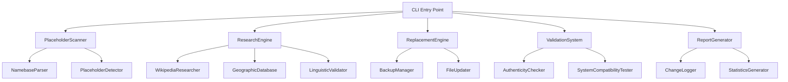

# Design Document: Placename Placeholder Replacement

## Overview

This system will systematically identify and replace placeholder placenames in the Fantasy Map Generator's namebases-real.js file with authentic, researched placenames representative of their respective language groups. The system will maintain the existing Markov-based name generation functionality while improving the authenticity and cultural accuracy of generated names.

**Scope Analysis**: The current system contains approximately **12,600+ placeholder entries** using multiple patterns:
- **Standard `_unq` patterns**: `language_index_unq1`, `language_index_unq2`, etc. (~10,400 instances)
- **Shortened `_u` patterns**: `language_index_u1`, `language_index_u2`, etc. (~2,200 instances)  
- **Truncated patterns**: Placeholders that appear cut off mid-generation
- **Mixed patterns**: Various combinations of the above formats

These placeholders are concentrated in the latter portion of the file (lines ~1400-2500+) and represent hundreds of different language groups worldwide, making this a substantial data curation project.

## Architecture

The system follows a modular architecture with clear separation of concerns:



## Components and Interfaces

### PlaceholderScanner
Responsible for identifying all placeholder entries in the namebases system.

```javascript
class PlaceholderScanner {
  constructor(namebaseFilePath) {}
  
  // Scan for all placeholder patterns
  async scanPlaceholders() {}
  
  // Extract language group information
  extractLanguageInfo(entry) {}
  
  // Generate analysis report
  generateScanReport() {}
}
```

### ResearchEngine
Handles the research and validation of authentic placenames for each language group.

```javascript
class ResearchEngine {
  constructor(config) {}
  
  // Research placenames for a specific language group
  async researchPlacenames(languageGroup, count = 12) {}
  
  // Validate authenticity of placenames
  async validateAuthenticity(placenames, languageGroup) {}
  
  // Get placenames from multiple sources
  async getFromMultipleSources(languageGroup) {}
}
```

### ReplacementEngine
Manages the systematic replacement of placeholders with researched placenames.

```javascript
class ReplacementEngine {
  constructor(backupManager, fileUpdater) {}
  
  // Replace placeholders in a namebase entry
  async replacePlaceholders(entry, newPlacenames) {}
  
  // Apply all replacements to the file
  async applyReplacements(replacementMap) {}
  
  // Validate replacement integrity
  validateReplacements(originalEntry, updatedEntry) {}
}
```

### ValidationSystem
Ensures the quality and compatibility of replacements.

```javascript
class ValidationSystem {
  constructor() {}
  
  // Check linguistic authenticity
  validateLinguisticAuthenticity(placenames, languageGroup) {}
  
  // Test system compatibility
  testSystemCompatibility(updatedFile) {}
  
  // Validate generation patterns
  validateGenerationPatterns(namebase) {}
}
```

## Data Models

### PlaceholderEntry
```javascript
{
  name: string,           // Language group name
  index: number,          // Namebase index
  originalPlaceholders: [string], // Original placeholder names
  languageInfo: {
    iso: string,
    family: string,
    region: string,
    speakers: number
  },
  metadata: {
    min: number,
    max: number,
    d: string,
    m: number
  }
}
```

### ResearchResult
```javascript
{
  languageGroup: string,
  placenames: [string],
  sources: [{
    name: string,
    url: string,
    reliability: number
  }],
  confidence: number,
  notes: string
}
```

### ReplacementRecord
```javascript
{
  entry: PlaceholderEntry,
  originalPlaceholders: [string],
  newPlacenames: [string],
  researchResult: ResearchResult,
  timestamp: Date,
  status: 'pending' | 'applied' | 'validated' | 'failed'
}
```

## Research Strategy

### Primary Sources
1. **Wikipedia Language Pages**: Extract placenames from language-specific Wikipedia articles
2. **Geographic Databases**: Use OpenStreetMap and GeoNames for authentic place names
3. **Linguistic Resources**: Consult academic databases and language documentation projects
4. **Government Sources**: Official geographic naming authorities where available

### Research Process
1. **Language Identification**: Map placeholder entries to specific languages using ISO codes
2. **Geographic Context**: Identify traditional territories and current speaker populations
3. **Historical Validation**: Ensure placenames are historically appropriate for the language group
4. **Phonological Validation**: Verify names follow the language's sound patterns
5. **Cultural Sensitivity**: Ensure respectful representation of indigenous and minority languages

### Quality Criteria
- Minimum 12 authentic placenames per language group
- Geographic and historical appropriateness
- Phonological consistency with language patterns
- Source reliability and academic credibility
- Cultural sensitivity and respectful representation

## Error Handling

### Research Failures
- **Insufficient Data**: Flag for manual research when fewer than 8 placenames found
- **Source Conflicts**: Prioritize academic and official sources over informal ones
- **Extinct Languages**: Use historical placenames with appropriate temporal context
- **Endangered Languages**: Prioritize community-approved sources

### System Failures
- **File Corruption**: Automatic rollback to backup on validation failure
- **Integration Issues**: Comprehensive testing before applying changes
- **Performance Impact**: Monitor name generation performance after updates

### Validation Failures
- **Authenticity Issues**: Flag questionable placenames for manual review
- **Pattern Mismatches**: Ensure new names fit existing generation patterns
- **Encoding Problems**: Handle special characters and diacritics properly

## Testing Strategy

The system will use both unit testing and property-based testing to ensure correctness and reliability.

### Unit Tests
- Test specific placeholder detection patterns
- Validate research result parsing
- Test file backup and restoration
- Verify replacement application accuracy

### Property-Based Tests
Property-based testing will validate universal properties across all inputs using a JavaScript property testing library like fast-check.

Each property test will run a minimum of 100 iterations and be tagged with comments referencing the design document property.

## Correctness Properties

*A property is a characteristic or behavior that should hold true across all valid executions of a system—essentially, a formal statement about what the system should do. Properties serve as the bridge between human-readable specifications and machine-verifiable correctness guarantees.*

### Property 1: Comprehensive Placeholder Detection
*For any* namebase file, the scanner should identify all 12,600+ placeholder patterns including `_unq\d+` variants, `_u\d+` patterns, and truncated formats, extracting associated language group information
**Validates: Requirements 1.1, 1.2, 1.3**

### Property 2: Multi-Source Research Coverage
*For any* language group research operation, the system should query multiple authoritative sources and prioritize academic/official sources when conflicts arise
**Validates: Requirements 2.1, 2.4**

### Property 3: Authenticity and Linguistic Validation
*For any* set of researched placenames, they should be geographically appropriate, historically accurate, and follow the phonological patterns typical of their language group
**Validates: Requirements 2.2, 2.3, 4.1, 4.3**

### Property 4: Replacement Preservation and Consistency
*For any* placeholder replacement operation, all original metadata should be preserved exactly while maintaining the same number of placename seeds
**Validates: Requirements 3.1, 3.2**

### Property 5: Backup and Recovery Integrity
*For any* file modification operation, a timestamped backup should be created that enables complete restoration of the original state
**Validates: Requirements 3.3**

### Property 6: Quality Threshold Maintenance
*For any* language group, the system should maintain a minimum of 12 authentic placenames with reliable source citations, or flag insufficient data for manual review
**Validates: Requirements 2.5, 4.5**

### Property 7: System Compatibility Preservation
*For any* updated namebase file, all existing language mixer tools and mappings should continue to function correctly with successful name generation
**Validates: Requirements 3.4, 4.2, 4.4**

### Property 8: Character Encoding Compatibility
*For any* placename containing special characters or diacritics, the authentic spelling should be preserved while maintaining compatibility with the name generation system
**Validates: Requirements 2.6**

### Property 9: Comprehensive Reporting and Documentation
*For any* replacement operation, detailed reports should be generated showing all changes organized by language group, including source citations and statistics
**Validates: Requirements 5.1, 5.2, 5.3**

### Property 10: Complete Audit Trail
*For any* replacement operation, a complete audit trail should be maintained with sufficient detail for rollback capabilities and future reference
**Validates: Requirements 5.4, 5.5**

## Implementation Phases

### Phase 1: Core Infrastructure
- Implement PlaceholderScanner and basic detection
- Create file backup and restoration system
- Set up testing framework and initial property tests

### Phase 2: Research Engine
- Implement Wikipedia and geographic database integration
- Create linguistic validation system
- Add source citation and reliability tracking

### Phase 3: Replacement System
- Implement systematic replacement engine
- Add validation and compatibility testing
- Create comprehensive error handling

### Phase 4: Reporting and Documentation
- Implement change logging and audit trails
- Create comprehensive reporting system
- Add CLI interface and user documentation

## Integration Points

### Existing Tools Compatibility
- **fix_unq_seeds.js**: Replace with new comprehensive system
- **Language Mixer Tools**: Ensure continued compatibility
- **Namebase Validation**: Integrate with existing validation workflows

### File System Integration
- **Backup Strategy**: Integrate with existing backup patterns
- **Configuration Files**: Maintain compatibility with language-mixer-map.json
- **Build Process**: Ensure integration with existing npm scripts

### Quality Assurance
- **Testing Integration**: Add to existing test suites
- **CI/CD Pipeline**: Integrate validation into build process
- **Documentation**: Update existing tool documentation